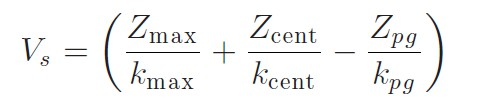
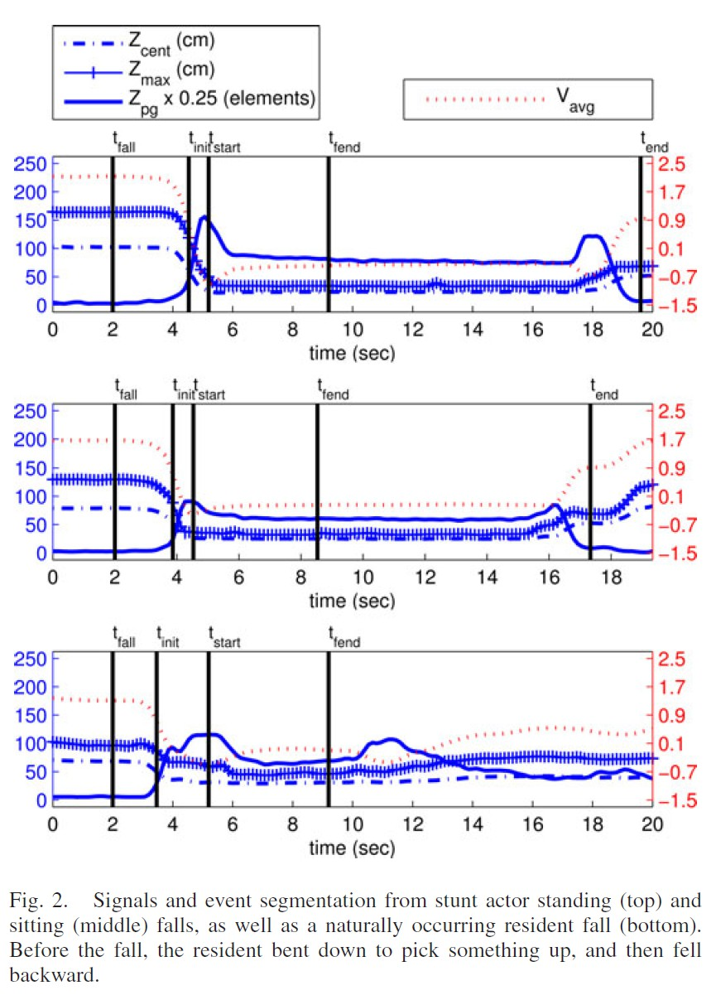

文中的算法主要分为两个阶段

- 第一阶段为通过深度图像画面提取人垂直状态（vertical state）的特征，然后对垂直状态时间序列按照目标在地面上的动作（on ground events)进行分割。
- 第二阶段用一些决策树（Ensemble Learning）来计算每个地面上动作可能是摔倒的概率。

Note： 文中的方法使用的是Kinect SDK的深度视频流，而没有使用其提供的骨骼追踪接口（skeletal tracking）。这是因为骨骼追踪接口有1.5至4米的距离限制，但是这并不能满足室内可能摔倒的范围。

如果我们使用骨骼追踪接口的话，则可以忽略文中的Dynamic background subtraction algorithm部分，这是用来通过深度图像画面来获得人的位置的。

详细的摔倒检测算法如下：

1. 第一阶段 - 垂直状态特征提取

    三个特征用来表示一个3-D物体在每一帧的垂直状态，分别为

    * 物体的最大高度（Z_max）
    * 物体质心的高度（Z-cent）
    * 地面上的38cm以下的物体的元素的个数（Z_pg）

    随后可以通过公式算出V_s{:height="50%" width="50%"}
    其中k_pg是通过训练数据得出的（所有样本Z_pg的平均值）

2. 第一阶段 - 地面上事件划分

    首先将垂直状态时间序列进行均值滤波（窗口大小为半秒）得到平滑后的信号V_arg(i)。随后进行下面的步骤来分割地面上的事件

    {:height="50%" width="50%"}

    其中f_rate为帧速率，T_trig为从训练数据得到的阈值。另外为了实现实时的摔倒检测，如果地面时间的结束没有在开始后的四秒内检测到，则标记t_fend并且开始计算摔倒的可能性。

    {:height="50%" width="50%"}

3. 第二阶段 - 地面上事件特征提取

    对于每个地面事件提取下面五个特征

    * 最小垂直速度（Minimun Vertical Velocity MVV）：从t_fall至t_start
    * 最大的垂直加速度（MVA）：从最小速度的时刻至t_start
    * V_arg的平均值：从t_start至t_fend，越高说明可能不是真真的摔倒
    * Z_pg的遮挡调整变化：（**这块没太看懂**）数值越高表示有物体从高处移至地处，数值越接近于0表示Z_pg没什么变化。
    * 最小的帧到帧垂直速率（MFFVV）：是MVV的估计

4. 第二阶段 - 计算摔倒置信度

    Ensemble Learning
